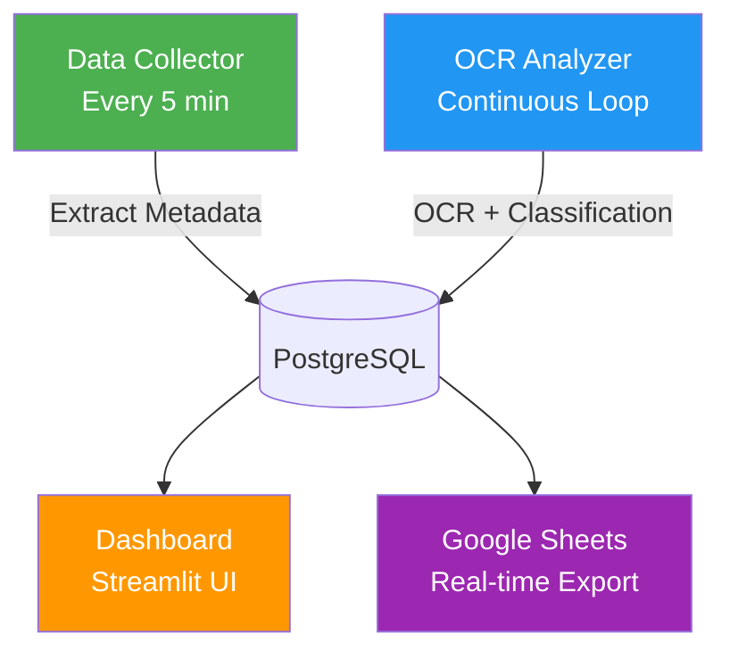

# 🖥️ Employee Screenshot Analytics System (MVP)

<div align="center">


**Automated employee productivity monitoring through intelligent screenshot analysis with OCR technology**

[Features](#-features) • [Architecture](#-architecture) • [Quick Start](#-quick-start) • [Documentation](#-documentation) • [Contributing](#-contributing)

</div>

---

## 📋 Overview

A production-ready system that automatically monitors employee work activity by analyzing desktop screenshots using advanced OCR (Optical Character Recognition) technology and keyword-based classification. The system provides real-time insights into productivity patterns, application usage, and work efficiency.

### ✨ Key Capabilities

- **🤖 Automated Data Collection**: Scans incoming screenshot folders every 5 minutes, extracts metadata from directory structure
- **🔍 Dual OCR Engine**: Tesseract + EasyOCR with OpenCV preprocessing for maximum accuracy (especially Russian text)
- **🎯 Smart Classification**: Rule-based detection of 100+ applications (Work vs Personal vs Unknown)
- **📊 Interactive Dashboard**: Streamlit-based analytics with productivity KPIs, rankings, and violation feeds
- **📄 Google Sheets Integration**: Real-time data export with structured formatting
- **🗃️ PostgreSQL Storage**: Reliable data persistence with automatic rotation (30 days)
- **🐳 Docker Orchestration**: One-command deployment with health checks and network isolation
- **🔐 Security**: Password hashing, read-only mounts, service account authentication

---

## 🏗️ Architecture



### System Components

| Component | Technology | Purpose |
|-----------|-----------|---------|
| **Data Collector** | Python + Watchdog | Monitors `incoming/` folder, parses employee/date/time from paths, copies to structured storage |
| **OCR Analyzer** | Tesseract/EasyOCR + OpenCV | Text recognition with image preprocessing, keyword-based classification |
| **Dashboard** | Streamlit + Plotly | Interactive web UI with charts, filters, and real-time updates |
| **Database** | PostgreSQL 16+ | Centralized storage for screenshots, analysis results, keywords |
| **Google Sheets** | Google API v4 | Cloud-based reporting with automatic synchronization |

---

## 🚀 Quick Start

### Prerequisites

- **Docker** & **Docker Compose** installed
- **Git** for cloning the repository
- **Python 3.11+** (optional, for local development)
- **Google Service Account** (for Sheets integration - optional)

### 1️⃣ Clone Repository

```bash
git clone https://github.com/YOUR_USERNAME/screenshot-analytics-mvp.git
cd screenshot-analytics-mvp
```

### 2️⃣ Configure Environment

```bash
# Copy example configuration
cp .env.example .env

# Edit with your settings (database passwords, Google credentials, etc.)
nano .env
```

**Required environment variables:**
```env
POSTGRES_USER=admin
POSTGRES_PASSWORD=your_secure_password
GOOGLE_SHEETS_CREDENTIALS=config/service_account.json
ADMIN_PASSWORD=dashboard_admin_password
```

### 3️⃣ Setup Google Sheets (Optional)

Follow the [Google Sheets Setup Guide](GOOGLE_SHEETS_SETUP.md) to configure real-time data export.

### 4️⃣ Deploy with Docker

```bash
# Build and start all services
docker-compose up -d --build

# Check service status
docker-compose ps

# View logs
docker-compose logs -f ocr-analyzer
```

### 5️⃣ Access Dashboard

Open your browser and navigate to:
```
http://localhost:8501
```

Default admin credentials are set in `.env` file.

---

## 📊 Features in Detail

### 🔬 OCR Recognition Pipeline

The system uses a sophisticated multi-stage OCR process:

1. **Image Preprocessing** (OpenCV):
   - Grayscale conversion
   - Adaptive thresholding (binary + inverse)
   - CLAHE (Contrast Limited Adaptive Histogram Equalization)
   - Median blur for noise reduction
   - 2x scaling for small text enhancement

2. **Dual Engine Recognition**:
   - **Primary**: EasyOCR (superior for Russian text and complex UIs like SAP, 1C)
   - **Fallback**: Tesseract with LSTM engine (fast, reliable for Latin text)
   - Automatic failover if primary engine fails

3. **Text Post-processing**:
   - Unicode normalization
   - Whitespace cleanup
   - Language-specific corrections

### 🎯 Application Classification

**Keyword-based detection** with smart matching strategies:

#### Work Applications (Detected Examples)
- **Office Suite**: Excel, Word, PowerPoint, Outlook
- **Business Software**: 1C (Бухгалтерия, Предприятие), Bitrix24, CRM systems
- **Development Tools**: VS Code, PyCharm, Git, SQL Management Studio
- **Communication**: Teams, Slack, Zoom, WhatsApp Business
- **Browser Services**: Diadoc, Kontur, Sberbank Online, Tinkoff, Yandex, Google Docs
- **Design Tools**: Figma, Photoshop, Illustrator

#### Personal Applications (Detected Examples)
- **Social Media**: VK, Facebook, Instagram, TikTok
- **Entertainment**: YouTube, Kinopoisk, IVI, Netflix
- **Shopping**: Ozon, Wildberries, AliExpress
- **Gaming**: Steam, Epic Games, game titles

#### Matching Strategy by Word Length
- **1-2 chars**: Strict negative lookahead/lookbehind (prevents false positives)
- **3 chars**: Word boundaries `\b`
- **4-6 chars**: Word boundaries only (no partial matching)
- **>6 chars**: Partial matching with 70% threshold (OCR error tolerance)

### 📈 Dashboard Analytics

**Available Metrics:**
- Productivity percentage (work vs personal time)
- Top used applications per employee
- Hourly/daily/weekly trends
- Violation alerts (excessive personal app usage)
- Employee ranking by productivity score
- Keyword frequency analysis

**Filters:**
- Date range selection
- Employee filtering
- Application category
- Time period (hour/day/week/month)

---

## 🛠️ Configuration

### OCR Engine Selection

Control which OCR engine is used via environment variable:

```env
# Options: easyocr, tesseract, auto (default: auto)
OCR_ENGINE=auto
```

- `easyocr`: Best for Russian text, complex interfaces
- `tesseract`: Faster, good for Latin text
- `auto`: Tries EasyOCR first, falls back to Tesseract on failure

### Keyword Customization

Edit keyword lists in [`ocr-analyzer/keyword_classifier.py`](ocr-analyzer/keyword_classifier.py):

```python
WORK_APPLICATIONS = {
    'browser_work': ['diadoc', 'kontur', 'sberbank', 'tinkoff', ...],
    'office': ['excel', 'word', 'powerpoint', 'outlook', ...],
    'development': ['vscode', 'pycharm', 'git', 'sql', ...],
    # Add custom categories here
}

PERSONAL_APPLICATIONS = {
    'social': ['vk', 'facebook', 'instagram', ...],
    'entertainment': ['youtube', 'kinopoisk', 'ivi', ...],
    # Add custom categories here
}
```

After changes, rebuild the analyzer:
```bash
docker-compose up -d --build ocr-analyzer
```

### Data Retention Policy

Automatic rotation is configured in `.env`:
```env
# Keep screenshots for 30 days
ROTATION_DAYS=30
```

Manual cleanup script:
```bash
python scripts/rotation.py
```

---

## 📁 Project Structure

```
screenshot-analytics-mvp/
├── data-collector/          # Screenshot ingestion service
│   ├── collector.py         # Main collection logic
│   ├── database.py          # DB operations
│   └── requirements.txt
├── ocr-analyzer/            # OCR and classification service
│   ├── analyzer.py          # Main analysis loop
│   ├── ocr_engine.py        # Tesseract/EasyOCR wrapper
│   ├── keyword_classifier.py # Application detection logic
│   └── requirements.txt
├── dashboard/               # Streamlit web interface
│   ├── app.py               # Main dashboard
│   ├── auth.py              # Authentication
│   └── requirements.txt
├── db-init/                 # Database initialization
│   ├── init.sql             # Schema creation
│   └── migrate_*.sql        # Migration scripts
├── config/                  # Configuration files
│   └── service_account.json # Google Sheets credentials
├── scripts/                 # Utility scripts
│   ├── rotation.py          # Data cleanup
│   └── sync_google_sheets.py # Manual sync trigger
├── incoming/                # Input folder for new screenshots
├── storage/                 # Persistent storage (screenshots, logs)
├── docker-compose.yml       # Service orchestration
├── .env                     # Environment variables (create from .env.example)
└── README.md                # This file
```

---

## 🔧 Development

### Local Setup (Without Docker)

```bash
# Create virtual environment
python -m venv venv
source venv/bin/activate  # Linux/Mac
# or
venv\Scripts\activate     # Windows

# Install dependencies for each service
pip install -r data-collector/requirements.txt
pip install -r ocr-analyzer/requirements.txt
pip install -r dashboard/requirements.txt

# Initialize database
psql -U postgres -c "CREATE DATABASE screenshot_analytics;"
psql -U postgres -d screenshot_analytics -f db-init/init.sql

# Run services manually
python data-collector/collector.py
python ocr-analyzer/analyzer.py
streamlit run dashboard/app.py
```

### Running Tests

```bash
# Test 1C context detection
python scripts/test_1c_context.py

# Test browser service details
python scripts/test_browser_details.py

# Test Bitrix false positive prevention
python scripts/test_bitrix_detection.py

# Test Russian business terms
python scripts/test_russian_business.py
```

All tests should pass with ✅ status.

---

## 📈 Performance Metrics

### Accuracy Statistics (Current Version)

- **Total Screenshots Processed**: 2,213
- **Work Classification Rate**: 94.5% (2,092 screenshots)
- **Unknown Rate**: 4.7% (103 screenshots)
- **Personal Classification Rate**: 0.8% (18 screenshots)
- **False Positive Rate**: <2% (after Bitrix/VK fixes)

### Processing Speed

- **Average OCR Time**: 2-5 seconds per screenshot (depending on resolution)
- **Classification Time**: <100ms per screenshot
- **Collection Interval**: Every 5 minutes
- **Dashboard Refresh**: Real-time (WebSocket updates)

---

## 🔐 Security Considerations

1. **Password Storage**: SHA256 hashing with salt for dashboard admin
2. **Database Access**: Restricted to internal Docker network
3. **Service Accounts**: Google API credentials stored in `config/` (not committed to Git)
4. **Read-Only Mounts**: Dashboard container has read-only access to storage
5. **Environment Variables**: Sensitive data in `.env` (excluded from version control)

**Best Practices:**
- Never commit `.env` file
- Rotate database passwords regularly
- Use strong passwords for admin accounts
- Enable HTTPS for production deployments
- Regular security audits of dependencies

---

## 🐛 Troubleshooting

### Common Issues

**Problem**: OCR analyzer shows "Нет скриншотов для анализа"
```bash
# Check if screenshots exist in database
docker exec screenshot-postgres psql -U admin -d screenshot_analytics \
  -c "SELECT status, COUNT(*) FROM screenshots GROUP BY status;"

# Reset pending screenshots if needed
docker exec screenshot-postgres psql -U admin -d screenshot_analytics \
  -c "UPDATE screenshots SET status = 'pending' WHERE status = 'error';"
```

**Problem**: EasyOCR not detecting Russian text properly
```bash
# Verify Russian language pack is installed
docker exec screenshot-analyzer dpkg -l | grep tesseract-ocr-rus

# Rebuild container with updated packages
docker-compose up -d --build ocr-analyzer
```

**Problem**: Dashboard not showing data
```bash
# Check database connection
docker-compose logs dashboard | grep "Connection"

# Verify data exists
docker exec screenshot-postgres psql -U admin -d screenshot_analytics \
  -c "SELECT COUNT(*) FROM analysis_results;"
```

**Problem**: Google Sheets sync failing
```bash
# Test credentials
python scripts/sync_google_sheets.py --test

# Check service account permissions
# Ensure email in service_account.json has editor access to the sheet
```

### Viewing Logs

```bash
# All services
docker-compose logs -f

# Specific service
docker-compose logs -f ocr-analyzer
docker-compose logs -f data-collector
docker-compose logs -f dashboard

# Last 100 lines
docker-compose logs --tail=100 ocr-analyzer
```

---

## 📚 Documentation

Comprehensive guides available:

- **[ARCHITECTURE.md](ARCHITECTURE.md)** - Detailed system architecture and design decisions
- **[QUICKSTART.md](QUICKSTART.md)** - Step-by-step quick start guide
- **[GOOGLE_SHEETS_SETUP.md](GOOGLE_SHEETS_SETUP.md)** - Google Sheets integration setup
- **[EASYOCR_SETUP.md](EASYOCR_SETUP.md)** - EasyOCR installation and configuration
- **[MIGRATION_POSTGRESQL.md](MIGRATION_POSTGRESQL.md)** - Database migration guide
- **[CHANGELOG.md](CHANGELOG.md)** - Version history and changes
- **[DETAILED_INFO_STATUS.md](DETAILED_INFO_STATUS.md)** - Details extraction status
- **[FIX_FALSE_POSITIVES.md](FIX_FALSE_POSITIVES.md)** - False positive prevention guide

---

## 🔄 Recent Improvements (v2.1)

### Latest Updates (June 2026)

✅ **Enhanced 1C Detection**
- Context-based fallback when OCR misreads "1С" as "1@"
- Detects accounting software via surrounding business terms
- Reduced unidentified work screenshots by 50% (67 → 33)

✅ **Browser Service Detail Extraction**
- Shows specific service names (Diadoc, Kontur, Sberbank) instead of generic "browser_work"
- Clean output without duplication
- Human-readable Russian names

✅ **Russian Business Terms Support**
- Added detection for Сбербанк, ИФНС, налоговая, ФНС, Инфо Трейд
- Eliminated false "unknown" classifications for government/tax services

✅ **Bitrix False Positive Prevention**
- Fixed detection where "МИНА РИКС" triggered false Bitrix matches
- Implemented word boundary matching for 4-6 character words
- Prevents partial substring matching errors

✅ **VK/Social Media False Positive Fix**
- Removed generic keywords causing false detections
- Improved specificity for social media classification

---

## 🤝 Contributing

Contributions are welcome! Please follow these steps:

1. **Fork** the repository
2. **Create** a feature branch (`git checkout -b feature/amazing-feature`)
3. **Commit** your changes (`git commit -m 'Add amazing feature'`)
4. **Push** to the branch (`git push origin feature/amazing-feature`)
5. **Open** a Pull Request

### Development Guidelines

- Follow PEP 8 for Python code style
- Write docstrings for all functions and classes
- Add tests for new features
- Update documentation when changing functionality
- Use semantic versioning for releases

Please read our [Contributing Guide](CONTRIBUTING.md) for details on our code of conduct and development process.

---

## 📄 License

This project is licensed under the MIT License - see the [LICENSE](LICENSE) file for details.

---

## 👥 Authors & Acknowledgments

**Developed by**: Your Team Name  
**Version**: 2.1.0  
**Last Updated**: June 2026

**Technologies Used**:
- [Tesseract OCR](https://github.com/tesseract-ocr/tesseract) - Open-source OCR engine
- [EasyOCR](https://github.com/JaidedAI/EasyOCR) - Ready-to-use OCR with multilingual support
- [OpenCV](https://opencv.org/) - Computer vision library
- [Streamlit](https://streamlit.io/) - Fastest way to build data apps
- [PostgreSQL](https://www.postgresql.org/) - Advanced open-source database
- [Docker](https://www.docker.com/) - Containerization platform

---

## 📞 Support

For issues, questions, or contributions:

- 🐛 **Bug Reports**: [GitHub Issues](https://github.com/YOUR_USERNAME/screenshot-analytics-mvp/issues)
- 💬 **Discussions**: [GitHub Discussions](https://github.com/YOUR_USERNAME/screenshot-analytics-mvp/discussions)
- 📧 **Email**: your.email@example.com

---

<div align="center">

**⭐ If this project helped you, please give it a star!**

Made with ❤️ for productivity monitoring

</div>
